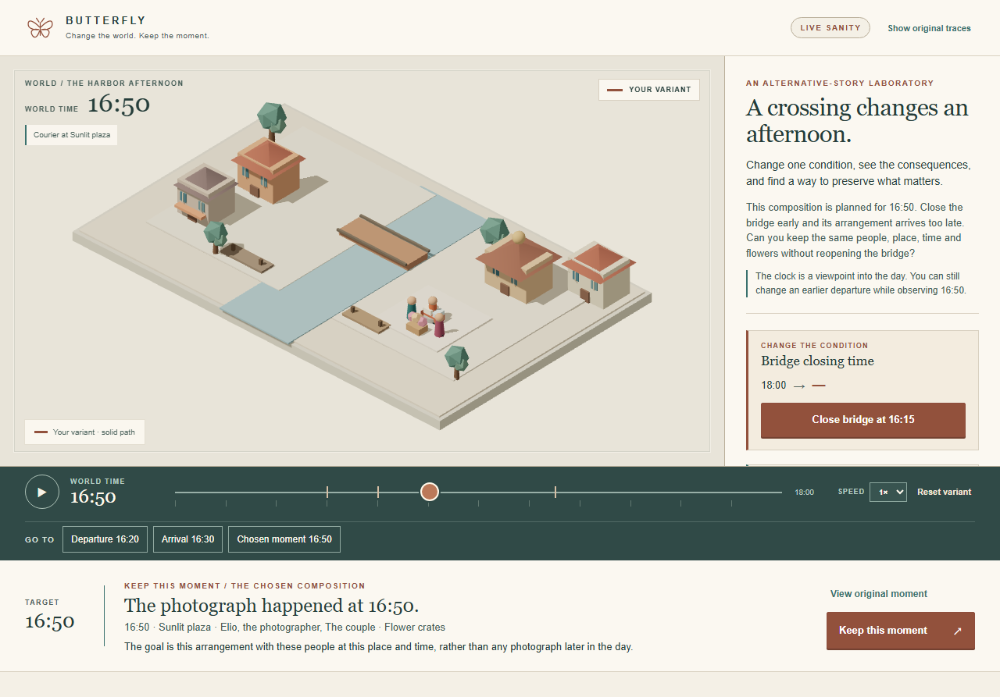
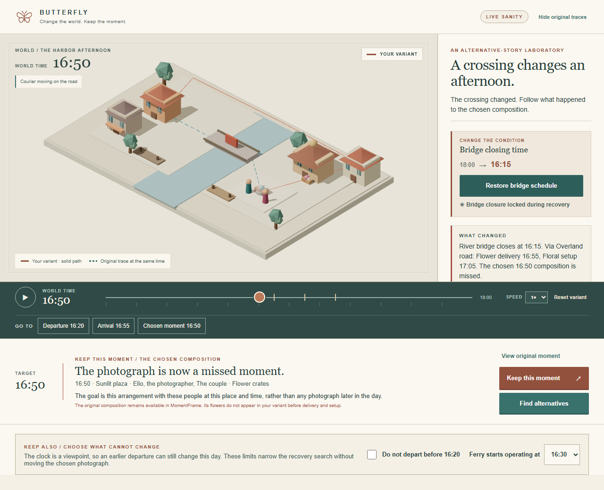
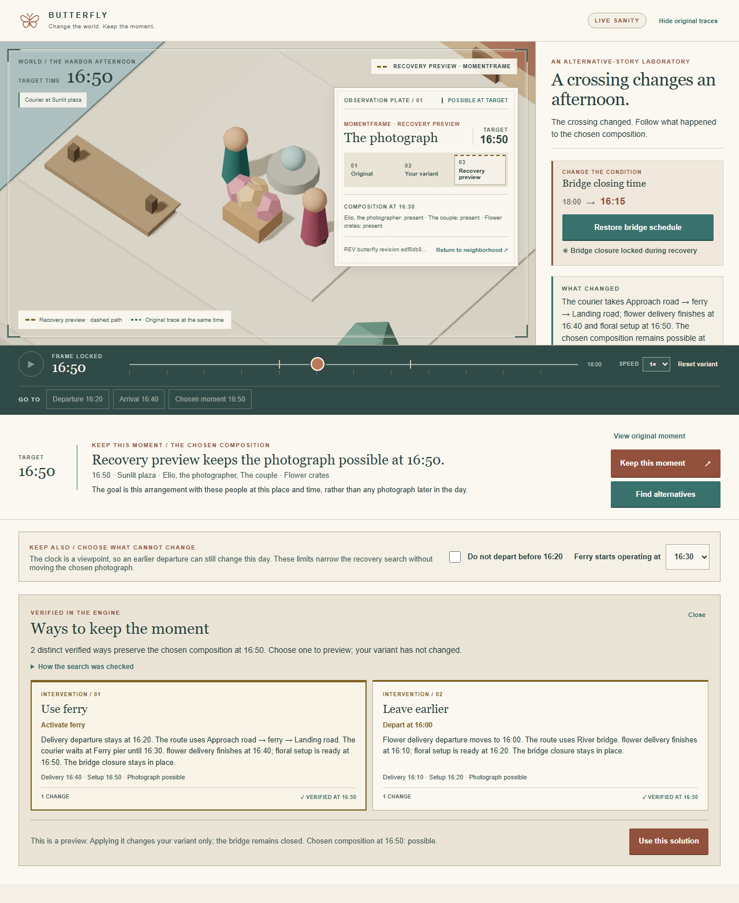
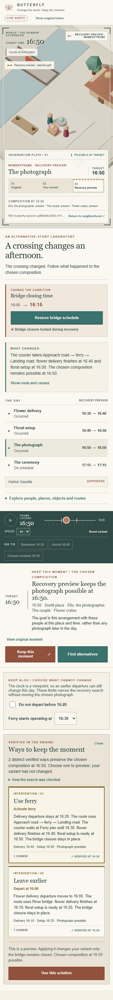

# BUTTERFLY

**Change the world. Keep the moment.**

[](https://github.com/Daniele-Cangi/Butterfly/deployments/production)
[](LICENSE)
[](https://nextjs.org/)
[](https://www.sanity.io/)

BUTTERFLY is a small, authored world you can inspect in 3D. Change one condition in a harbor afternoon, watch the courier and delivery take a different route, and see which events still happen. Choose a photograph at a fixed place and time, then ask the simulation to find permitted changes that make that same composition possible again.

The city is the interface. A deterministic TypeScript engine decides what happens; the diorama, timeline, MomentFrame and causal inspector all present that same result.

## The harbor afternoon

The featured photograph is scheduled for 16:50 in Sunlit plaza. In the original day, the bridge stays open until 18:00. A 16:20 courier departure reaches the plaza at 16:30, the flower arrangement is ready at 16:40, and the photograph can happen.

Close the bridge at 16:15 and follow the change:

1. The courier can no longer cross the bridge and takes the 35-minute road route.
2. The delivery arrives at 16:55; the arrangement is ready at 17:05.
3. The 16:50 photograph is missed, while the independent 17:15 ceremony remains possible.
4. The Gazette claim about the photograph is no longer supported by the simulated events.
5. Select **Keep this moment**. The MomentFrame preserves the original event, time, place and essential requirements.
6. Find alternatives. The engine verifies a ferry activation (delivery 16:40, setup 16:50) and an earlier 16:00 departure (delivery 16:10, setup 16:20). The bridge closure remains locked.
7. Preview an intervention without changing the variant, then choose **Use this solution** to apply it locally.

The boundary rule is explicit: a requirement completed exactly when an event starts is satisfied. The ferry is an authored connection that exists before the search; neither its route nor the recoveries are hardcoded to story labels.

## Screenshots

These are full-page browser captures of the working experience, using the published Butterfly revision from the local Sanity reader. The Vercel production deployment is connected; its server still needs a Viewer token for live Sanity reads (see [Live content](#live-content-and-sanity)).

### The neighborhood at the chosen time



### The missed photograph



### A verified recovery preview



<details>
<summary>View the mobile recovery flow</summary>



</details>

## Run locally

Requires Node.js 22.12 or later.

```bash
npm ci
npm run dev
```

Open <http://localhost:3000>. With no Sanity configuration, the app labels its source **Local sample** and runs the same validated fixture and engine used for live content. No login, model API or network connection is needed for the core journey.

The first view shows the original 16:50 composition. Use **Close bridge at 16:15**, inspect **What changed** or the causal inspector, then select **Keep this moment** and **Find alternatives**. Select a recovery card to preview it; **Use this solution** applies it to your local variant. **Reset variant** restores the starting revision.

### Commands

```bash
npm run dev
npm run typecheck
npm run lint
npm test
npm run build
npm run test:browser
```

Playwright runs the end-to-end journey in Chromium and saves the full-page captures under `screenshots/`. The browser tests cover the original day, bridge closure, missed MomentFrame, recovery search and preview, Apply, Reset, timeline controls, reduced motion, mobile layout and the text-only mode used when WebGL is unavailable.

Space toggles playback, arrow keys seek by one minute, and event buttons jump to key times. Reduced-motion preferences disable automatic playback. If WebGL cannot start, the text view and controls still let you complete the journey.

## How the simulation works

- **One source of truth:** the fixture and frozen Sanity revision pass through the same Zod schemas and pure simulation engine.
- **Time-aware routes:** connections have explicit endpoints, transport modes, integer durations, availability windows and visual route segments. Routing can wait at places, and a connection must stay available for the entire crossing.
- **No automatic rescue:** a scheduled event that cannot meet its requirements is marked impossible and produces no effects. Missing or unresolved information can produce unknown; missing data is never treated as satisfied.
- **Stable comparisons:** original, variant and recovery preview are simulated at the same playhead. Timed route samples drive actor positions independently of render frame rate.
- **A fixed moment:** Keep this moment targets the same event, 16:50 start, plaza and essential composition requirements. It does not move the photograph or relax a requirement.
- **A bounded search:** the engine tests allowlisted interventions against the current variant, then calculates all side effects for each candidate. The default search considers at most two changes and 30 candidates. Results are ranked by intervention count, then event-time movement, then stable ID—not by an opaque quality score.
- **Honest search states:** an already-satisfied target, found alternatives, a fully explored domain with no alternative, a budget-limited search and an indeterminate result are reported separately. Exhausting this catalog says nothing about interventions outside it.
- **Local visitor state:** Apply changes the visitor's isolated variant only. Reset returns to the anchored snapshot; it never writes to the shared Sanity dataset.

The engine uses integer minutes from the scenario's explicit origin. Availability windows use inclusive starts and exclusive ends; a trip may finish exactly at a connection's exclusive end, but cannot start then. Requirements completed exactly at event start are satisfied. Events are resolved in stable ID order, while each requirement read considers only temporally relevant results; planned does not mean occurred.

This is one intentionally small narrative world, not a general-purpose transport planner or an urban economy simulator. The current model covers authored facts and events, dependent journeys, timed connection geometry, route waiting, frozen snapshots and a finite recovery catalog. It does not model arbitrary resource contention or every possible city system.

## Live content and Sanity

Copy `.env.example` to `.env.local` and configure the dedicated BUTTERFLY project and dataset:

```dotenv
NEXT_PUBLIC_SANITY_PROJECT_ID=your_project_id
NEXT_PUBLIC_SANITY_DATASET=production
SANITY_API_READ_TOKEN=your_viewer_token
```

The project ID and dataset name are public configuration. `SANITY_API_READ_TOKEN` is an optional **server-only Viewer token** for datasets that do not allow anonymous reads. Never add it to a `NEXT_PUBLIC_*` variable or commit it. `SANITY_API_TOKEN` is a separate optional server/CLI write token used by authorized seed and publication commands.

The public experience reads a complete frozen revision from Sanity on the server. Visitors do not need accounts or API keys. If a live read fails, the app explicitly labels the local fallback **Local sample (live unavailable)** and exposes the connection error; it does not pretend the sample came from Sanity.

The repository is linked to Vercel and the Production build is deployed. At the latest README verification, Vercel's `/api/version` returned `503 Live version unavailable`; configure `SANITY_API_READ_TOKEN` for the Vercel Production environment and redeploy to make the active Sanity revision available there. The deployment URL checked during verification also required Vercel sign-in, so this README does not present it as a public demo link.

### Authoring and publication

`/studio` hosts Sanity Studio and a Director view that reuses the same scene and engine. Studio editing requires Sanity authentication and the exact app origin in the project's CORS settings. It does not grant anonymous visitors authoring permissions.

```bash
npm run seed:sanity
npm run status:sanity
npm run publish:sanity -- --expected-rev=<pointer-revision>
```

The seed command creates missing Butterfly authoring documents without overwriting editorial changes. Publication reads and validates the authoritative draft, reruns the engine, writes a complete frozen snapshot, then updates the active pointer only if its expected revision still matches. A conflict requires a fresh review; it is never silently merged. The public reader validates the pointer, revision and snapshot identities before loading content.

## Project map

```text
app/             Next.js experience, version API and Sanity Studio
src/world/       world types, Zod validation, snapshots and patches
src/engine/      pure deterministic simulation, comparison and recovery search
src/scene/       Three.js diorama, route trajectories and MomentFrame
src/ui/          timeline, inspector, version selection and local variant
src/sanity/      Sanity schemas, readers, authoring and Director
fixtures/        local sample world in the live content shape
tests/           engine regressions and Playwright journeys
screenshots/     browser captures from the journey
scripts/         authorized Sanity seed, status and publication commands
docs/            operational blueprint and build notes
```

See [docs/BLUEPRINT.md](docs/BLUEPRINT.md) for the world and engine contract, [docs/BUILD_NOTES.md](docs/BUILD_NOTES.md) for verified implementation history and remaining setup, and [AGENTS.md](AGENTS.md) for repository invariants and commands.

Original code is available under the [MIT License](LICENSE). The procedural scene uses no third-party art assets.
